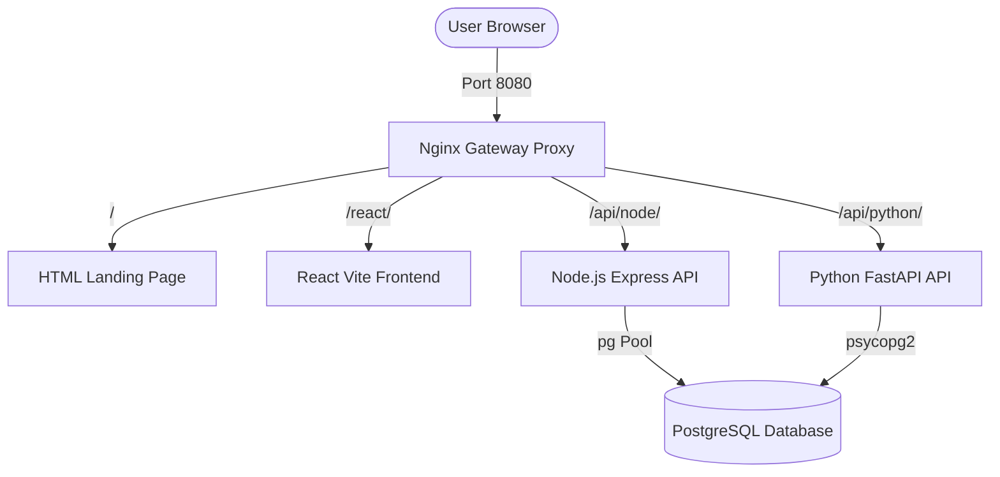

# Portfolio Multi-Stack Developer Workspace

Welcome to your containerized portfolio development environment. This workspace is structured as a modular, multi-service monorepo. It runs entirely inside Docker with network isolation, unified path routing, database initialization, and live hot-reloading.

---

## Workspace Architecture

All client and API requests are routed through a single **Nginx Gateway Proxy** on port `8080`. This routes incoming traffic to the appropriate container, preventing CORS issues.



---

## Service Port Map

| Public URL Path | Port (Host) | Internal Port | Technology Stack | Description |
| :--- | :--- | :--- | :--- | :--- |
| **`http://localhost:8080/`** | `8080` | `80` | Nginx (Alpine) | Entry point proxy & static HTML landing page |
| **`http://localhost:8080/react/`** | `8080` | `5173` | React 18 & Vite | React Dashboard frontend with HMR enabled |
| **`http://localhost:8080/api/node/`** | `8080` | `5000` | Node.js & Express | Backend API handling Database writes |
| **`http://localhost:8080/api/python/`** | `8080` | `8000` | Python 3.12 & FastAPI | Backend API running Python logic |
| *Internal Only* | - | `5432` | PostgreSQL 16 | Relational Database storing contacts data |

---

## Quick Start

### 1. Build and Start the Environment
Run the following command at the root of your workspace:
```bash
docker compose up --build
```

### 2. Verify Health Endpoints
Open your browser or terminal to check connection mappings:
- **Landing Page**: `http://localhost:8080/`
- **React Dashboard**: `http://localhost:8080/react/`
- **Node.js Health Check**: `http://localhost:8080/api/node/health`
- **Python Health Check**: `http://localhost:8080/api/python/health`
- **FastAPI Interactive Docs**: `http://localhost:8080/api/python/docs`

### 3. Stop the Containers
To stop and clean up containers and networks:
```bash
docker compose down
```

---

## Development Guide

### 1. Hot-Reloading (HMR)
Both backend APIs (Node/Express with `nodemon` and Python/FastAPI with `uvicorn --reload`) and the React frontend (Vite) are configured to watch your code files.
- Any change you make in `frontend-react/src/`, `backend-node/server.js`, or `backend-python/main.py` is immediately applied inside the running container without requiring a rebuild!

### 2. Migrating Landing Page to Tailwind CSS
The `landing-page` service is pre-configured to compile Tailwind CSS using a multi-stage Docker build.
To use Tailwind on your HTML landing page:
1. Open [landing-page/src/input.css](file:///e:/Projects/workspace/Portfolio/landing-page/src/input.css) to add custom Tailwind rules.
2. In [landing-page/index.html](file:///e:/Projects/workspace/Portfolio/landing-page/index.html), add:
   ```html
   <link href="/dist/output.css" rel="stylesheet">
   ```
3. Run `docker compose build landing-page` to compile your new styles.
4. During local development, you can run watch mode:
   ```bash
   cd landing-page
   npm install
   npm run watch:css
   ```

### 3. Integrating Supabase
To link Supabase database features (like Auth, Storage, Edge Functions) to your local containers, please follow the detailed setup instructions in [supabase/README.md](file:///e:/Projects/workspace/Portfolio/supabase/README.md).

### 4. Deploying to Vercel
- **Frontend React**: Vite applications deploy seamlessly to Vercel. You can install the Vercel CLI (`npm install -g vercel`) and run `vercel` in the `frontend-react` folder, or connect your GitHub repository and point Vercel's root directory configuration to `frontend-react`.
- **Node.js**: Express apps can be deployed to Vercel using Serverless Functions (by creating a `vercel.json` routing configuration mapping routes to `api/index.js`).

---

## How to Add a New Tech Stack Component (e.g., Go, Ruby, Next.js)

To scale this workspace with more technologies:
1. **Create Directory**: Create a folder for the service (e.g., `backend-go`).
2. **Add Dockerfile**: Write a Dockerfile exposing its port (e.g. `8080`).
3. **Configure Compose**: Define the service in `docker-compose.yml` under the `services` section:
   ```yaml
   backend-go:
     build:
       context: ./backend-go
     networks:
       - portfolio-network
   ```
4. **Proxy Route**: Open `gateway/nginx.conf` and map a path to the service:
   ```nginx
   location /api/go/ {
       proxy_pass http://backend-go:8080/api/go/;
       proxy_set_header Host $host;
   }
   ```
5. **Re-run Gateway**: Restart containers using `docker compose up --build`. Your new stack is now live!
